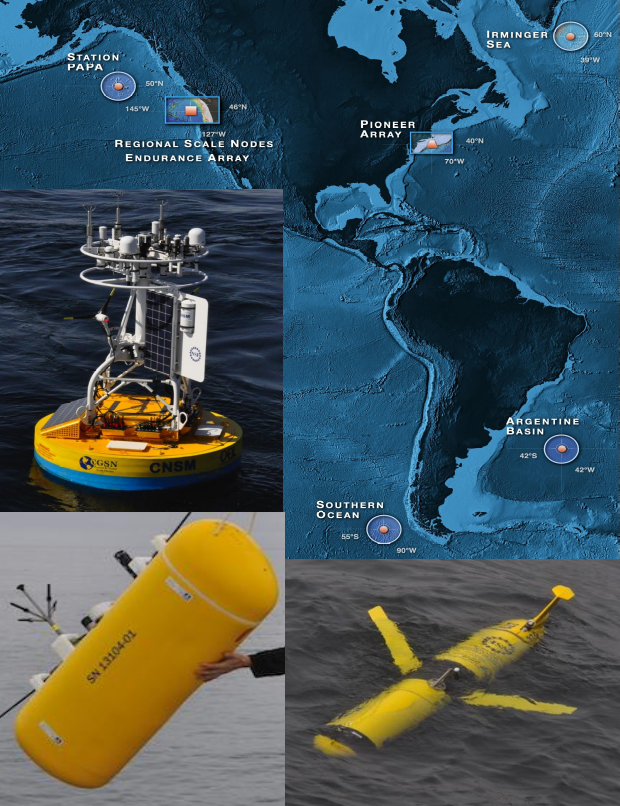
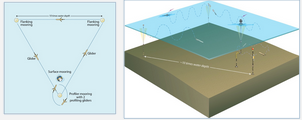
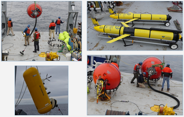
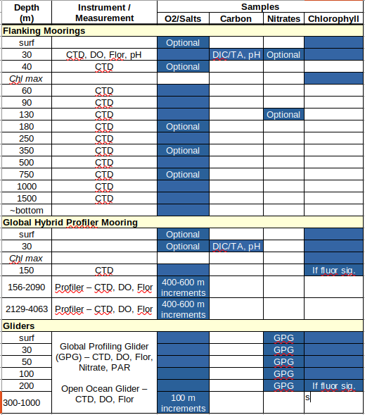

# Global Ocean Station Papa: Assets and Datasets

#### Author: Andrew Reed

---
### Ocean Observatories Initative
The Ocean Observatories Initiative (OOI) is an NSF-funded project for long-term (25 years) infrastructure for ocean observations. There are three main elements of OOI: (1) The Regional Cabled Array off the coast of Washington; (2) the Endurance Array on the Oregon-Washington shelf; and (3) the Coastal & Global Scale Nodes with mooring arrays in the Irminger Sea (Irminger Sea Array), at Ocean Station Papa (Papa Array), in the Southern Ocean and Argentine Basin (descoped and no longer collecting data), and at the New England Shelf (Pioneer Array-NES).

<figure>

<figcaption align = "center"><b>Figure 1: Map of the OOI Arrays with (closewise from bottom right) a glider, a wire-following profiler, and a coastal surface mooring.</b></figcaption>
</figure>

### Global Ocean Station Papa Array
This poster highlights the assets and datasets available from the OOI Global Ocean Station Papa Array (60$^{\circ}$N, 39$^{\circ}$W). The Global Ocean Station Papa Array is composed of three moorings arrayed in a triangle. At the Apex is a hybrid profiling mooring. At the other two vertices are two subsurface moorings, Flanking Moorings A & B. Addtionally, gliders are deployed at the array to regularly profile and transit around the array. The Global Ocean Station Papa array is unique in that, unlike the Global Irminger Sea Array in the North Atlantic, it does not have an Apex Surface Mooring. Instead, the OOI array is designed to complement the surface assets NOAA's Pacific Marine Environmental Lab maintains at the location.

<figure>

<figcaption align="left"><b>Figure 2: Schematic of an OOI Global Array mooring arrangement.</b></figcaption>
</figure>

<figure>

<figcaption align="left"><b>Figure 3 (clockwise from top left): A global hybrid  wire-following-profile mooring being deployed; two global open ocean gliders; a global surface mooring being deployed; a wire-following profiler.</figcaption>
</figure><b>
<b>

The assets deployed at OOI measure a range of physical, chemical, and biological parameters. Additionally, OOI collects water samples during each deployment and recovery of each instrument on the moorings, and have them analyzed for a full-suite of parameters. Analysis include oxygen, salinity, nutrients (nitrate, nitrite, ammonium, phosphate, silicate), chlorophyll, and carbon system. A summary of the available sensors and water sampling are shown in the table below.

<figure>

<figcaption align="left"><b>Table 1. Table of available datasets on different platforms at the OOI Papa array along with discrete water sampling, which occurs during deployment/recovery.</figcaption>
</figure>

### Major Science Themes
The Global Ocean Station Papa Array is designed to investigate three of the seven major science themes motivating the OOI. These science themes are:
1. **Climate Variability, Ocean Food Webs, and Biogeochemical Cycling**

  A compelling driver for the multidisciplinary and biogeochemical observations at Ocean Station Papa is understanding how climate variability will affect ocean food webs, weather patterns, the ocean’s biochemical environment and marine ecosystems.
2. **Turbulent Mixing and Biophysical Interactions**

  Turbulent mixing plays a critical role in the transfer of materials within the ocean and in the exchange of energy and gases between the ocean and atmosphere. Additionally, horizontal and vertical mixing within the ocean can have a profound effect on a wide variety of biological processes.
3. **Ocean-Atmosphere Exchange**

  Quantifying the air-sea exchange of energy and mass, especially during high winds (greater than 20 ms-1), is critical to providing estimates of energy and gas exchange between the surface and deep ocean and to improving the predictive capability of storm forecasting and climate-change models. Ocean Station Papa investigates these questions by collecting complementary data to NOAA’s PMEL Carbon Buoy.
